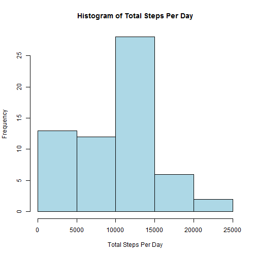
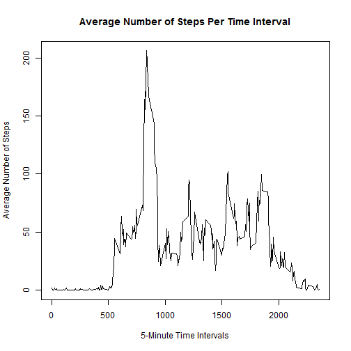
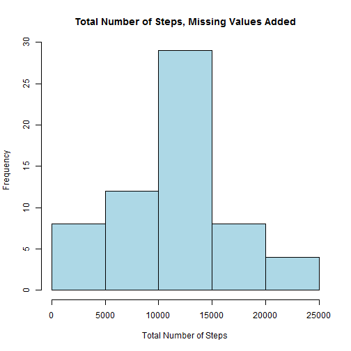
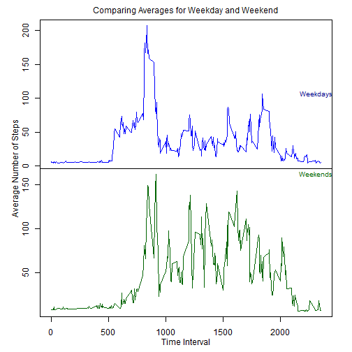

##Loading and preprocessing the data
For this assignment, I chose to assume that each person would have access to the data in his/her own directory. My code to read in the data is as follows:


```r
data <- read.csv("activity.csv")
```
As you can see, I saved the dataset to the variable name "data" and did not have the need to process the data any further at this point.

##What is mean total number of steps taken per day?
**- Make a histogram of the total number of steps taken each day**  
For this question, I used the tapply function to split the steps data by day, apply the sum function to calculate the sum each subset, and return the output: 

```r
Totaldailysteps <- with(data, tapply(data$steps, data$date, sum, na.rm=TRUE))
hist(Totaldailysteps,col = "light blue", main="Histogram of Total Steps Per Day",xlab = "Total Steps Per Day")
```

 

**- Calculate and report the mean and median total number of steps taken per day**  
To calculate the mean, I applied the mean function to my calculated vector of the total number of steps taken each day and made sure to define "na.rm=TRUE" in order to obtain a number result. I did the same for calculating the median:

```r
mean(Totaldailysteps, na.rm=TRUE) 
```

```
## [1] 9354
```

```r
median(Totaldailysteps, na.rm=TRUE)
```

```
## [1] 10395
```

##What is the average daily activity pattern?  
**- Make a time series plot (i.e. type = "l") of the 5-minute interval (x-axis) and the average number of steps taken, averaged across all days (y-axis)**  
I interpreted this question as looking at the average number of steps taken in each of the 5-minute intervals corresponding across each day. To get to this result, used tapply to subset the steps dataset by intervals and then apply the mean function to each interval subset. I then plotted the result:  

```r
avgdailysteps <- with(data, tapply(data$steps,data$interval,mean,na.rm=TRUE))
plot(unique(data$interval),avgdailysteps,type="l", main = "Average Number of Steps Per Time Interval",xlab = "5-Minute Time Intervals", ylab = "Average Number of Steps")
```

 

**- Which 5-minute interval, on average across all the days in the dataset, contains the maximum number of steps?**  
By applying max() to the average steps taken daily in each 5-minute interval, we get this result:  

```r
findmaxminuteint <- which.max(avgdailysteps)
findmaxminuteint
```

```
## 835 
## 104
```

```r
maxminuteint <- max(avgdailysteps)
maxminuteint
```

```
## [1] 206.2
```
Therefore, the 835 minute interval [indexed at 104 in avgdailysteps variable] contains the maximum of approximately 206 steps.

##Imputing missing values  
**- Calculate and report the total number of missing values in the dataset (i.e. the total number of rows with NAs)**  
Because the only measurement column is data$steps, I used is.na() to find the number of NA values in the dataset:  

```r
findNAs <- sum(is.na(data$steps))
findNAs
```

```
## [1] 2304
```

**- Create a new dataset that is equal to the original dataset but with the missing data filled in.**  
I chose to use the calculated means for steps taken in each 5-minute interval from a previous part of the assignment to fill in the missing NA values. Using for and if loops, I stepped through the steps column searching for NAs and replaced those values with the averages. The resulting data set is previewed below where you can see the missing value repeated in the first column where there were previously NAs:  

```r
splitbyint <- split(data, data$interval)
avgsteps <- rep(avgdailysteps,each=61)
avgstep_data <- cbind(data,avgsteps)

for(i in 1:length(data$steps)){
        if (is.na(data$steps[i])==TRUE){
                avgstep_data$steps[i]<-avgstep_data$avgsteps[i]
        }
}
#now remove the last column
finaldata <-avgstep_data[,c("steps","date","interval")]
head(finaldata,5)
```

```
##   steps       date interval
## 1 1.717 2012-10-01        0
## 2 1.717 2012-10-01        5
## 3 1.717 2012-10-01       10
## 4 1.717 2012-10-01       15
## 5 1.717 2012-10-01       20
```

**- Make a histogram of the total number of steps taken each day and Calculate and report the mean and median total number of steps taken per day. Do these values differ from the estimates from the first part of the assignment? What is the impact of imputing missing data on the estimates of the total daily number of steps?**  
The following code produces a histogram with the newly filled data entries:  

```r
newTotaldailysteps <- with(finaldata, tapply(finaldata$steps, finaldata$date, sum, na.rm=TRUE))
hist(newTotaldailysteps, main = "Total Number of Steps, Missing Values Added",xlab = "Total Number of Steps",col="light blue")
```

 

```r
mean(newTotaldailysteps, na.rm=TRUE)
```

```
## [1] 10890
```

```r
median(newTotaldailysteps, na.rm=TRUE)
```

```
## [1] 11015
```
It is apparent upon comparison of the two graphs, that replacing the missing values does affect the resulting totals by generally increasing them. In a real research study, this could greatly skew the results. The most obvious changes are that far fewer of the sums are within the 0<x<5000 range and more are within the 10000<x<15000 range. Additionally, we can observe that both the mean and median are greater values than the previously calculated mean and median.    

##Are there differences in activity patterns between weekdays and weekends?
**- Create a new factor variable in the dataset with two levels - "weekday" and "weekend" indicating whether a given date is a weekday or weekend day.**  
To add this new factor variable, I first created a vector of day by applying as.Date() to data$date. Using a for/if loop, the days were split into weekends and weekdays before being converted to factors. The final data set with the factor column is previewed below:

```r
weekday <-weekdays(as.Date(data$date,format = "%Y-%m-%d"),abbreviate = TRUE)
weekfactor <- NULL
for(j in 1:length(weekday)){
        if(weekday[j]=="Sat" | weekday[j]=="Sun"){
                weekfactor <- rbind(weekfactor,"weekend")
        }
        else{
                weekfactor<-rbind(weekfactor,"weekday")
        }
}
weekfactor <- as.factor(weekfactor)
finaldata <- cbind(finaldata[,c("steps","date","interval")],weekfactor)
head(finaldata,5)
```

```
##   steps       date interval weekfactor
## 1 1.717 2012-10-01        0    weekday
## 2 1.717 2012-10-01        5    weekday
## 3 1.717 2012-10-01       10    weekday
## 4 1.717 2012-10-01       15    weekday
## 5 1.717 2012-10-01       20    weekday
```
**- Make a panel plot containing a time series plot (i.e. type = "l") of the 5-minute interval (x-axis) and the average number of steps taken, averaged across all weekday days or weekend days (y-axis).**  
First, the data is subsetted into weekdays and weekends. Then, using tapply(), the steps data is split by interval data and then averaged. Finally, I make a multipaneled plot displaying the progression of average steps taken throughout the course of the day:  

```r
weekdaydata <- finaldata[weekfactor=="weekday",]
avgweekday <- with(weekdaydata, tapply(weekdaydata$steps,weekdaydata$interval,mean,na.rm=TRUE))

weekenddata <- finaldata[weekfactor=="weekend",]
avgweekend <- with(weekenddata, tapply(weekenddata$steps,weekenddata$interval,mean,na.rm=TRUE))

par(mar = c(0,0,0,0),mfrow=c(2,1),oma=c(3.5,4,2,2))
plot(unique(data$interval),avgweekday,type="l",col="blue",xaxt='n')
plot(unique(data$interval),avgweekend,type="l",col = "dark green")
mtext("Average Number of Steps",side=2,outer=TRUE,line=2)
mtext("Time Interval",side=1, outer=TRUE, line = 2)
mtext("Comparing Averages for Weekday and Weekend", side = 3, outer=TRUE, line = .5)
mtext("Weekdays",side=3,outer=FALSE,line = 7,adj=1,cex=.8,col = "dark blue")
mtext("Weekends",side=3,outer=FALSE,line=-1,adj=1,cex=.8,col="dark green")
```

 

There are two main observations from this multipaneled plot:  
- The subject's activity on the weekends begins later than on the weekdays  
- Although the peak number of steps on the weekdays is higher than the peak number of steps on the weekends, the activity on the weekend is consistently greater than on the weekdays. On average, the subject takes more steps on a weekend than on a weekday.
